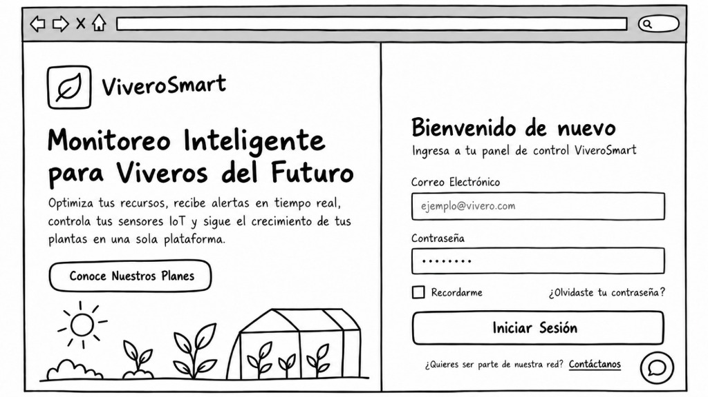
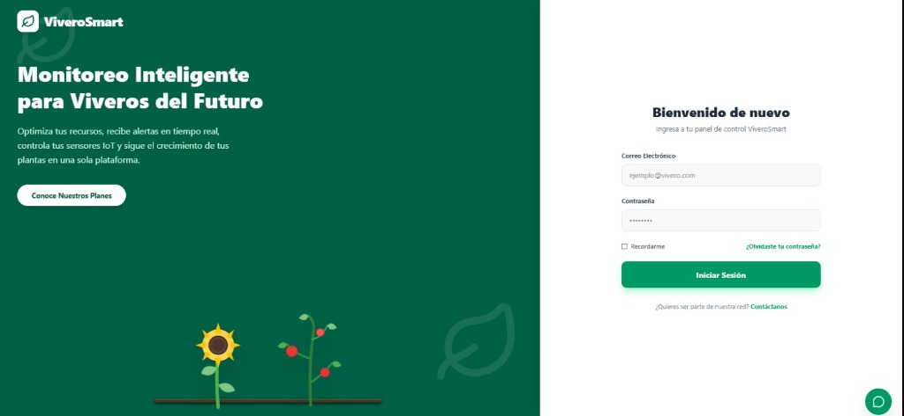
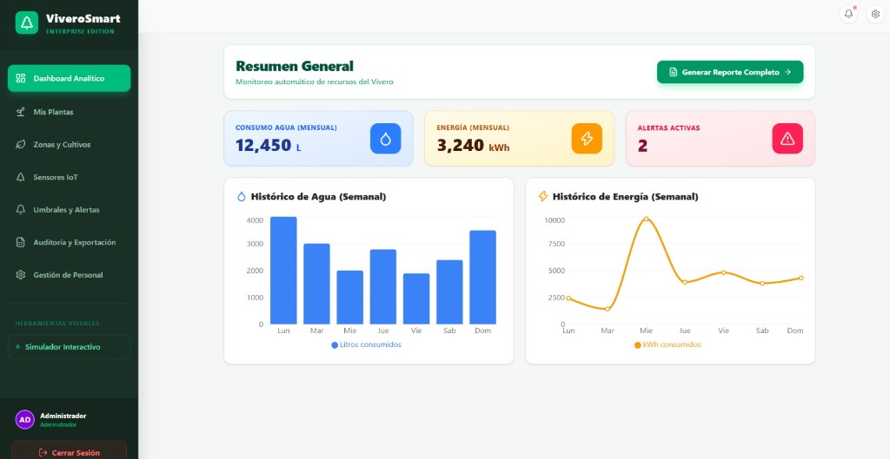
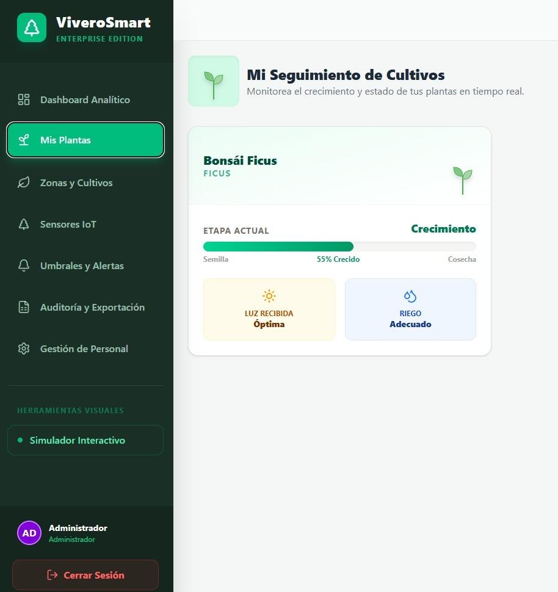
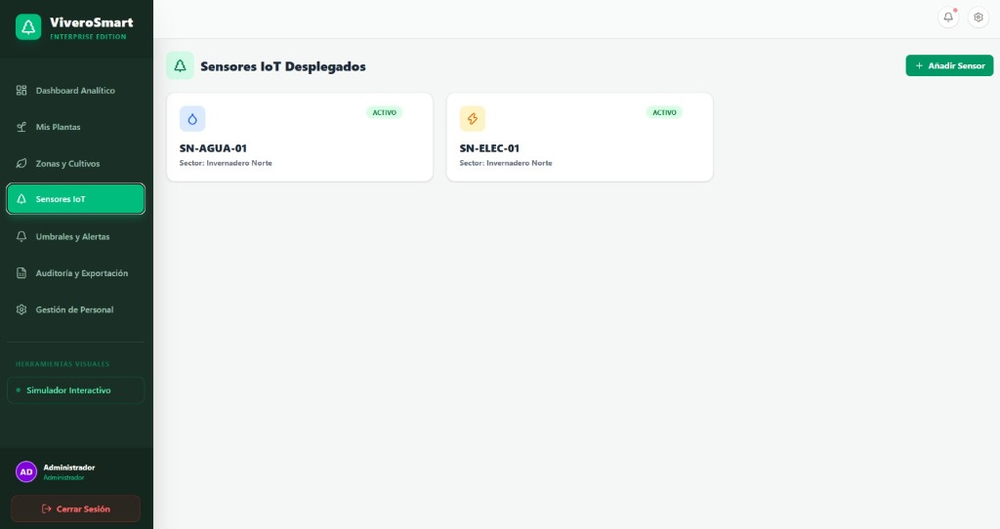
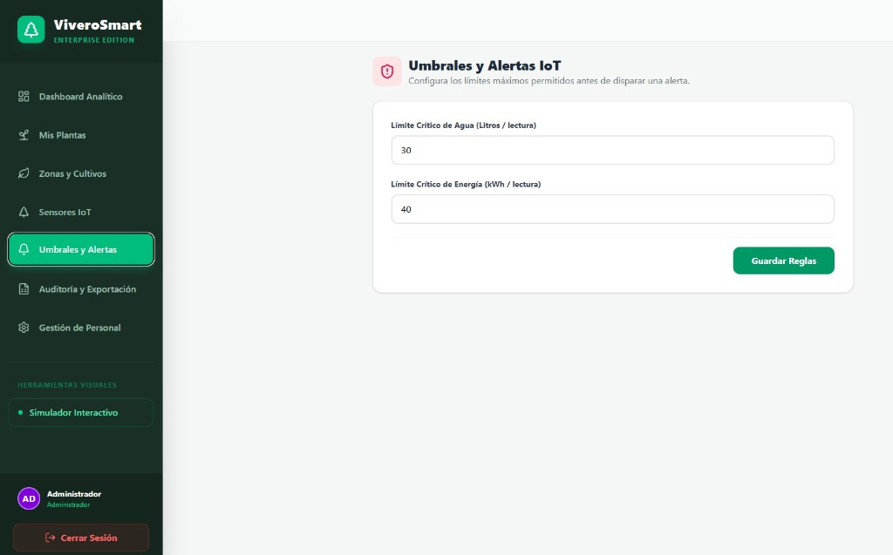

# Diseño del Sistema - ViveroSmart

En este documento se presentan los **Wireframes** y **Mockups** correspondientes al diseño frontend del sistema **ViveroSmart** (Monitoreo Inteligente para Viveros del Futuro). Todos los diseños de alta fidelidad han sido creados utilizando **Figma**.

## 1. Wireframes

Un wireframe es básicamente un boceto de una simple pantalla. Nos ayuda a estructurar la información y los elementos principales (campos de texto, botones, enlaces) sin enfocarnos en el diseño visual ni en los detalles estéticos.

*Descripción: Boceto inicial de la pantalla principal y de inicio de sesión de ViveroSmart. Muestra la disposición estructural de la propuesta de valor a la izquierda y el formulario de acceso a la derecha.*

---

## 2. Mockups (Diseñados en Figma)

Los mockups son versiones más detalladas que incluyen colores, botones, logos, iconos y un diseño visual mucho más definido y cercano al producto final. A continuación se presentan las pantallas principales del sistema ViveroSmart.

### 2.1 Pantalla de Inicio de Sesión (Login)

*Descripción: Pantalla de acceso al sistema con diseño de pantalla dividida, mostrando la propuesta de valor y el formulario de autenticación.*

### 2.2 Dashboard Analítico

*Descripción: Panel principal (Dashboard) que muestra un resumen general del consumo de agua y energía, alertas activas y gráficos históricos (semanales) de los recursos del vivero.*

### 2.3 Mis Plantas

*Descripción: Interfaz para el seguimiento de cultivos. Muestra el estado en tiempo real de una planta específica (ej. Bonsái Ficus), su etapa de crecimiento, nivel de luz recibida y estado de riego.*

### 2.4 Sensores IoT

*Descripción: Pantalla de gestión de sensores desplegados en el vivero, mostrando el estado activo de sensores de agua y electricidad por sectores (ej. Invernadero Norte).*

### 2.5 Umbrales y Alertas

*Descripción: Panel de configuración donde el administrador puede establecer los límites críticos (umbrales) de agua y energía antes de que el sistema dispare una alerta.*

## link del figma
https://evade-mesh-23797473.figma.site/

## Autores: 
*Nikolay Gorelkin Wills*
*Jose Fernando Daza Arias*
*Karla Noelia Choque Temo*	
*Pablo Alejandro Maldonado*

---

## 3. Diseño Responsivo (Responsive Design)

El sistema ha sido conceptualizado considerando un diseño responsivo. Esto garantiza que la interfaz de **ViveroSmart** se adaptará y se visualizará correctamente en cualquier tamaño de pantalla, ya sea en:
- Computadora de escritorio (Desktop)
- Tablet
- Teléfono móvil (Smartphone)
- iPad
